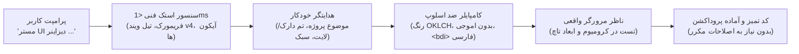

<div align="center">


# اکوسیستم Vibe UI Suite

**مهندسی قراردادمحور فرانت اند، قیدهای دیزاین سیستم و موتور اعتبارسنجی ران تایم برای دستیاران کدنویسی هوش مصنوعی.**

[](https://github.com/omid-io/vibe-ui-suite/actions/workflows/ci.yml)
[](https://www.npmjs.com/package/vibe-ui-suite)
[](https://www.npmjs.com/package/vibe-ui-suite)
[](https://open-vsx.org/extension/omid-io/vibe-ui-vscode)
[](https://marketplace.visualstudio.com/items?itemName=omid-io.vibe-ui-vscode)
[](https://github.com/omid-io/vibe-ui-suite)
[](LICENSE)
[](evals/)

<p align="center">
  <a href="README.md"><strong>English Documentation</strong></a> •
  <a href="ARCHITECTURE.md"><strong>مستندات معماری سیستم</strong></a> •
  <a href="docs/ENTERPRISE_ADAPTATION.md"><strong>راهنمای تطبیق سازمانی</strong></a> •
  <a href="https://omid-io.github.io/vibe-ui-suite/"><strong>استودیوی تعاملی کامپایلر آنلاین</strong></a>
</p>

</div>

---

## ⚖️ مقایسه خروجی: هوش مصنوعی معمولی در برابر Vibe UI v4.8 شاهکار

وقتی از یک هوش مصنوعی معمولی می خواهید کامپوننت فرانت اند تولید کند، چه تفاوتی رقم می خورد؟

```text
┌──────────────────────────────────────┐  در  ┌──────────────────────────────────────┐
│ ❌ خروجی کلیشه ای AI (Vanilla Slop)  │ برابر│ ✨ خروجی شاهکار Vibe UI v4.8         │
├──────────────────────────────────────┤      ├──────────────────────────────────────┤
│ • دکمه های تکراری با گرادیان بنفش   │      │ • نورپردازی اتمسفریک بوم و گرادیانت  │
│ • کنتراست ضعیف متن (۳.۲ به ۱ - مردود)│      │ • کنتراست ریاضی WCAG 2.2 AAA (۱۷.۸)  │
│ • سرریز افقی در موبایل (۳۷۵ پیکسل)   │      │ • ماک آپ پنجره macOS با لاگ زنده     │
│ • اموجی های متنی زرد و آماتور        │      │ • اسلایدر تعاملی درگ قبل و بعد       │
│ • کارت های استاتیک و بدون تعامل      │      │ • کدهای زنده React 19 TSX با استیت   │
│ • نبود فیزیک حرکتی و ترنزیشن خشک     │      │ • کرسر کینتیک پیکان و نقطه دنبال کننده│
│ • تصاویر خالی و لینک های شکسته       │      │ • عکس های حرفه ای ادیتوریال Unsplash │
│ • لود ناگهانی و پرش صفحه             │      │ • انیمیشن های مرحله ای و ریل مارکی   │
│ • به هم ریختگی ترکیب فارسی و انگلیسی  │      │ • تفکیک دقیق متن فارسی و کدهای LTR   │
└──────────────────────────────────────┘      └──────────────────────────────────────┘
```

👉 **[استودیوی کامپایلر طراحی آنلاین را زنده امتحان کنید](https://omid-io.github.io/vibe-ui-suite/)** — بدون تاخیر سرور، استنتاج آنی سمت کاربر و پیش نمایش بلادرنگ کامپوننت ها.

---

مجموعه **Vibe UI Suite** چارچوبی ساختاریافته، ماشین فهم و قابل سنجش در اختیار ادیتورها و ایجنت های هوش مصنوعی (Cursor، Claude Code، Windsurf و Antigravity) قرار می دهد تا رابط های کاربری را با اصول واقعی مهندسی فرانت اند طراحی، پیاده سازی و اعتبارسنجی کنند.

به جای اتکا به پرامپت نویسی شکننده («یک داشبورد شیک و مدرن بساز»)، این سیستم یک پایپ لاین صریح مشابه کامپایلر ایجاد می کند:

```text
قصد و خواسته کاربر
    ↓
بسط نیت و خواسته (قرارداد فنی ۳۰ پارامتری)
    ↓
اسکیمای ماشین فهم (design-spec.v1.schema.json)
    ↓
انتخاب کهن الگوی کلان (مخزن ۷ کهن الگوی دیزاین)
    ↓
پیاده سازی کد (Next.js 15 / React 19 TSX / Tailwind OKLCH)
    ↓
ارزیابی استاتیک (اسکیما، ریاضیات کنتراست، تست های منفی)
    ↓
ارزیابی زنده در مرورگر (پلی رایت در ویوپورت موبایل ۳۷۵ پیکسل)
    ↓
خروجی تست شده یا گزارش دقیق خطاهای مهندسی
```

> **شفافیت روز نخست:** این پروژه هم اکنون در نسخه `v4.8.0` (**استانداردهای کینتیک زنده و فیزیک کرسر پیکان**) است. مجهز به ۷ کهن الگوی کلان دیزاین (Linear Dev HUD، Swiss Editorial، Cupertino Glass، Full-Bleed Bento، Quiet Luxury، Cyber Terminal و Centered Stage)، استانداردهای کینتیک زنده لایتس ویند (کرسر کینتیک پیکان با زاویه سرعت و محو کامل کرسر سیستم عامل، نورپردازی اسپات لایت ماتریکس نقطه ای، ریل های متحرک افقی مارکی بدون وقفه، ادغام عکس های باکیفیت ادیتوریال Unsplash از طریق AssetDirector، انیمیشن های مرحله ای ورود با اسکرول و محو تدریجی بلور تصاویر)، نورپردازی محیطی بوم (ترکیب گرید مشبک ۳۶ پیکسلی و هاله نوری شعاعی عمیق)، ماک آپ پنجره macOS با سنجه های زنده تلمتری و لاگ استریم کوبرنتیز، اسلایدرهای درگ تعاملی قبل و بعد با آیکون های برداری SVG، تولید مستقیم کامپوننت های زنده React 19 TSX با فلگ `-f tsx`، سطوح میکرو اسپات لایت با گارد پرفورمنس ۶۰ هرتز موبایل، اجرای صددرصدی ارزیابی فیزیکی در مرورگر واقعی Chromium برای تمامی سناریوهای بنچمارک بدون رد کردن نمونه ای، و حاکمیت دو سطحی کنتراست (هدف گذاری WCAG AAA بالای ۷:۱ و گیت سخت گیرانه WCAG AA بالای ۴.۵:۱). از نقدها، باگ ریپورت ها و مشارکت های مهندسان فرانت اند صمیمانه استقبال می کنیم.

---

## 👑 ایجنت ارشد معماری فرانت اند: `vibe-ui-agent`

طراحی فرانت اند نباید توسعه دهنده را درگیر ریاضیات کنتراست رنگ، فرمول های OKLCH، پارامترهای فیزیک فنر در CSS یا حفظ کردن نام سبک ها کند. این بار فکری تماماً بر عهده ایجنت است.

مجموعه Vibe UI Suite دارای یک ایجنت معمار ارشد اختصاصی به نام **`vibe-ui-agent`** ([AGENT.md](vibe-ui-agent/AGENT.md)) است. این ایجنت با بهره گیری از **سنسور تشخیص استک فنی** (زیر ۱ میلی ثانیه) و **موتور هدایت خودکار**، فایل های `package.json`، نسخه تیل ویند و کامپوننت های پروژه شما را اسکن کرده و زیباترین سبک طراحی، ترکیب رنگی و ساختار صفحه را بدون پرسیدن سوالات خسته کننده پیاده سازی می کند.



---

### جریان اول: ساخت از صفر (پرامپت ۱-خطی و تنبل)
کافی است فقط یک جمله به زبان ساده به ایجنت خود (Antigravity، هرمس، Cursor یا Claude Code) بگویید:

```text
مستر UI دیزاینر، برای پروژه من یک صفحه لندینگ مدرن و کاربرپسند طراحی کن.
```

**اشاره اختیاری به سبک یا موضوع (هرگز اجباری نیست):**
- `مستر UI دیزاینر، یک داشبورد مالی و آمار کاربران با سبک روان اپل کوپرتینو پیاده سازی کن`
- `مستر UI دیزاینر، یک صفحه معاملات رمزارز با ظاهر دارک و ترمینالی بساز`
- `مستر UI دیزاینر، یک فرم نوبت دهی شیک برای کلینیک زیبایی طراحی کن`

**تضمین های خودکار مستر UI دیزاینر:**
- **حذف کامل اموجی های متنی:** جایگزینی با آیکون های وکتور SVG خطی و زیبا با رنگ جاری (`currentColor`).
- **کنتراست ریاضی WCAG AAA:** تنظیم دقیق رنگ های متن و پس زمینه در فضای رنگی پیشرفته OKLCH.
- **ایزوله سازی راست چین و اعداد:** قرار دادن تمام قیمت ها، درصدها و کلمات انگلیسی در تگ `<bdi>` تا چینش خطوط فارسی هرگز واژگون نشود.
- **ارگونومی تاچ موبایل:** تضمین ابعاد حداقل ۴۴ در ۴۴ پیکسل برای تمام دکمه ها جهت لمس راحت در گوشی.
- **فیزیک فنری زنده:** انیمیشن های نرم با رفتار فنر فیزیکی (`ease-vibe-spring`) و خروج بسیار سریع (زیر ۱۸۰ میلی ثانیه).

---

### جریان دوم: جراحی و نجات رابط کاربری زشت (رفع خطاهای هوش مصنوعی)
هنگامی که یک کامپوننت یا صفحه دارید اما ظاهر آن بی کیفیت، کلیشه ای یا به هم ریخته است (گرادیان های تکراری بنفش، اموجی های زرد، یا فارسی وارونه):

```text
مستر UI دیزاینر، این رابط کاربری خیلی زشت و کلیشه ای شده؛ با استانداردهای Vibe UI بازطراحیش کن.
```

**مواردی که در چند ثانیه اصلاح می شوند:**
1. حذف تمام اموجی ها و جایگزینی با آیکون های برداری تمیز.
2. محاسبه مجدد کنتراست رنگ ها برای پاس کردن سخت گیرانه استاندارد WCAG 2.2 AA و AAA.
3. ایزوله سازی ارقام و کدها با تگ `<bdi>` جهت تثبیت ساختار راست چین.
4. تبدیل ترنزیشن های خشک و کند خطی به حرکات فنری روان.

---

### جریان سوم: راه اندازی خودکار پروژه بدون نیاز به ترمینال
هنگام آغاز به کار روی یک پروژه جدید، بدون نیاز به باز کردن پاورشل یا ترمینال:

```text
پکیج vibe-ui-suite را در پروژه نصب و پیکربندی کن و قوانین vibe-ui-agent را فعال نما.
```

**اقدامات کاملاً خودکار ایجنت:**
1. اجرای دستور `npm install vibe-ui-suite` در ترمینال پروژه.
2. اضافه کردن خط `@import "vibe-ui-suite/v4.css";` به فایل اصلی استایل (`app/globals.css` یا `src/index.css`).
3. ایجاد فایل قوانین ادیتور (`.cursorrules` یا `CLAUDE.md` یا `AGENTS.md`) با دستورالعمل های کامل مستر UI دیزاینر.

---

### 🎨 ۷ کهن الگوی کلان دیزاین (انتخاب هوشمند یا به دلخواه شما)
نیازی نیست سبکی را حفظ کنید—`vibe-ui-agent` با توجه به حوزه کاری پروژه، بهترین سبک را از **مخزن الگوهای دیزاین** (`data/design_vault/archetypes.json`) انتخاب می کند. با این حال می توانید به هر یک از کهن الگوها اشاره کنید:

| کهن الگوی کلان | فلسفه طراحی | فیزیک سطوح و نورپردازی | بهترین کاربرد |
| :--- | :--- | :--- | :--- |
| **`Linear Dev HUD`** | بوم های ابسیدین تیره، تلمتری ترمینال های میکرو، فونت های مونو | هاله نوری فیروزه ای و زمردی، خطوط مویی آینه ای، اسپارک لاین K8s | زیرساخت ابری، ابزارهای توسعه، سیستم های مانیتورینگ |
| **`Swiss Editorial`** | سلسله مراتب تایپوگرافی نامتقارن، وقار مجله ای سوئیسی | کنتراست مونوکروم دقیق، خطوط مویی راهنما، تعادل سریف و سنس | نشریات، مد و پوشاک، معماری، استودیوهای لوکس |
| **`Cupertino Glass`** | شیشه مات چندلایه، گوشه های نرم اسکوئرکل، انیمیشن های فنری سیال | عمق محیطی، سطوح مایع شیشه ای، بازخوردهای لمسی بهینه | استارتاپ های مدرن، وب اپلیکیشن های موبایل، سلامت |
| **`Full-Bleed Bento`** | گرید ۴ خانه بنتو نامتقارن، وزن های بصری متغیر، اسپارک لاین پویا | های لایت های مویی در لبه بالا، رادیانس نوری ردگیری ماوس | پلتفرم های هوش مصنوعی، ابزارهای خلاقانه سازمانی |
| **`Quiet Luxury`** | پالت های گرم سنگ و شامپاینی، ظرافت سریف، دقت کلینیکال | اسلایدرهای درگ تعاملی قبل و بعد، نشان های اصالت و سرتیفیکیت | کلینیک های دندانپزشکی و زیبایی، فروشگاه های لوکس |
| **`Cyber Terminal`** | فسفر سبز و کهربایی رترو-فیوچریستیک، اسکن لاین، چگالی اطلاعاتی بالا | ماتریس هاد مونو، نشانگرهای وضعیت زنده، حداقل حاشیه نویسی | وب۳، سیستم های ممیزی امنیت، اینترفیس های سخت افزاری |
| **`Centered Stage`** | ارائه تکی محصول در مرکز، تایپوگرافی بزرگ و درشت، استیج معلق سه بعدی | مخروط هاله نوری شعاعی عمیق، شبکه مشبک ۳۶ پیکسلی پس زمینه | لندینگ پیج های با نرخ تبدیل بالا، رونمایی محصولات |

---

### تولید خودکار اینترفیس از طریق ترمینال (`vibe_cli.py`)
تولید مستقیم اپلیکیشن های کامل و خودکفای وب یا کامپوننت های ماژولار React 19 از طریق خط فرمان:

```bash
# ۱. تولید فایل خودکفای HTML شاهکار با اسلایدرهای تعاملی و هیرو macOS:
python vibe_cli.py generate "یک سایت کلینیک زیبایی با رزرو آنلاین و نمونه کارهای قبل و بعد" -o clinic.html

# ۲. تولید کامپوننت زنده React 19 / TypeScript (.tsx) با هوک های استیت:
python vibe_cli.py generate "A modern developer observability dashboard with latency metrics" -f tsx -o DevDashboard.tsx

# ۳. ارزیابی و ممیزی هر فایل تولید شده بر اساس استانداردهای شش گانه:
python vibe_cli.py verify clinic.html
```

---

### روش جایگزین: ویزارد تعاملی ترمینال (CLI)
اگر ترجیح می دهید از طریق منوی تعاملی ترمینال پروژه را آماده کنید:
```bash
npx vibe-ui-suite init
```
این دستور فایل قوانین ادیتور، استایل های پیش فرض و تم انتخابی شما را به صورت خودکار پیکربندی می کند.

---

## 🎨 سازگاری بومی با Tailwind CSS v4 (@theme) — بدون نیاز به کانفیگ

در فایل `app/globals.css` یا استایل شیت اصلی پروژه:
```css
@import "tailwindcss";
@import "vibe-ui-suite/v4.css";
```
بدون نیاز به نوشتن حتی یک خط فایل کانفیگ جاوااسکریپتی، کلاس های زیر فوراً فعال می شوند:
- **رنگ های معنایی OKLCH:** `bg-vibe-canvas`, `bg-vibe-surface`, `text-vibe-primary`, `border-vibe-border`
- **منحنی های فیزیک حرکت:** `ease-vibe-spring`, `ease-vibe-snap`, `ease-vibe-glide` (یا کلاس `.vibe-spring`)
- **سایه های متریال:** `shadow-vibe-brutal`, `shadow-vibe-glass`

---

## 📦 تزریق کامپوننت های تست شده هوش مصنوعی (`add`)

کامپوننت های آماده و دسترسی پذیر را مستقیماً داخل پوشه `components/vibe-ui/` پروژه خود دریافت کنید:
```bash
# دراور تاشوی استدلال هوش مصنوعی با ترنزیشن گرید و پالس رادار
npx vibe-ui-suite add thinking-drawer

# هاد تله متری با ساختار ایزوله LTR برای نمایش لتنسی و توکن ها
npx vibe-ui-suite add telemetry-hud

# بج اعتبارسنجی ریاضیاتی کنتراست WCAG 2.2 AA / AAA
npx vibe-ui-suite add contrast-badge
```
مشاهده فهرست تمام کامپوننت های موجود:
```bash
npx vibe-ui-suite list
```

---

## 💻 افزونه ادیتورها (VS Code & Cursor)

افزونه رسمی Vibe UI مستقیماً در سایدبار ادیتور شما فعال است:

- **VS Code Marketplace:** [`omid-io.vibe-ui-vscode`](https://marketplace.visualstudio.com/items?itemName=omid-io.vibe-ui-vscode)
- **Open-VSX Registry:** [`omid-io.vibe-ui-vscode`](https://open-vsx.org/extension/omid-io/vibe-ui-vscode) (مخصوص Cursor، Windsurf، VSCodium)

### امکانات افزونه:
- **ماشین حساب زنده کنتراست WCAG 2.2:** محاسبه آنی و ریاضیاتی نسبت روشنایی ($L_1 / L_2$) با انتخاب رنگ و نمایش زنده وضعیت قبولی AA و AAA.
- **درج ۱-کلیک کامپوننت:** کلیک روی دکمه **Insert into Active Editor** برای نوشتن کد کامپوننت در موقعیت مکان نما.
- **دستور بررسی سریع فایل:** با فشردن `Ctrl+Shift+P` و اجرای `Vibe UI: Audit Active File Contrast`.

---

## 🏛️ معماری: پایپ لاین هماهنگی ۶ مهارت تخصصی

هماهنگی فرآیندها توسط ایجنت معمار ارشد فرانت اند (**`vibe-ui-agent`**) انجام می شود که ۶ ساب اسکیل تخصصی را هدایت می کند:

| مهارت تخصصی | نقش و محدوده وظایف | قید و مکانیزم اصلی |
| :--- | :--- | :--- |
| **`autonomous-intent-expander`** | بسط پرامپت با بودجه ابهام زدایی کالیبره شده | پرهیز از حدس زدن الزامات کسب وکار و تبدیل به قرارداد ۳۰ پارامتری |
| **`visual-chemistry-engine`** | انتخاب سیستم زیبایی شناسی یکپارچه | ۵ استایل متمایز با قانون جلوگیری از شباهت به وبسایت های قبلی |
| **`ui-kit`** | کامپوننت ها و الگوهای تعاملی هوش مصنوعی | دراور پردازش فکر، چیپ ابزارها، هاد تله متری، الگوهای بنتو |
| **`vibe-physics-engine`** | فیزیک انیمیشن، رنگ های ادراکی و بودجه GPU | فضای رنگی OKLCH، منحنی اسپرینگ، سقف حداکثر ۳ لایه بلور |
| **`conversion-copy-engine`** | روایت ارزش و سناریوی شفاف محصول | متن های داده محور؛ ممنوعیت اکید نظرات ساختگی و فوریت فیک |
| **`ui-verifier`** | گیت های اعتبارسنجی کیفیت و دسترس پذیری | محاسبات استاتیک + تست زنده DOM در مرورگر پلی رایت |

---

## 🎨 ۵ استایل بصری و شیمی دیزاین

1. **Minimalist SaaS:** سادگی تک رنگ، بردرهای ظریف، تراکم اطلاعات بالا، تایپوگرافی کاربردی (`oklch(0.12 0.01 260)`).
2. **Luxury Obsidian / Glass 2.0:** سطوح تیره، هایلایت های فرنل، تاکیدهای طلایی ظریف، مدیریت بودجه بلور GPU (`oklch(0.08 0.02 270)`).
3. **Neobrutalism:** کارت های اشباع، سایه های سخت هندسی ۳ پیکسلی مشکی، بدون بلور، مرزهای صریح فیزیکی (`oklch(0.98 0.02 95)`).
4. **Swiss Editorial:** گرید نامتقارن، چیدمان متن محور الهام گرفته از مکتب بین المللی سوئیس (`oklch(0.97 0.005 80)`).
5. **Stripe Crisp Light:** دیزاین روشن داکیومنت های فنی، خطوط تفکیک میکرونی، سایه های محو (`oklch(0.99 0.002 250)`).

---

## ⚡ استانداردهای حرکتی کینتیک لایتس ویند (نسخه ۴.۸.۰)

یک تجربه فرانت اند حرفه ای و مدرن باید از نظر فیزیکی زنده، ملموس و واکنش گرا باشد. نسخه ۴.۸ این پروژه ۶ اصل حرکتی را به صورت الزامی پیاده سازی می کند:

۱. **کرسر کینتیک پیکان و فیزیک دنبال کننده:**
   - مخفی سازی کامل کرسر پیش فرض سیستم عامل (`cursor: none !important`).
   - نقطه دقیق و بدون تاخیر با نور ملایم (`#vibeCursorDot`) با تعقیب یک به یک مختصات موس.
   - پیکان برداری SVG دنبال کننده (`#vibeCursorFollower`) با محاسبه زاویه دوران سرعت و اینرسی فنری (`Math.atan2`).
۲. **شبکه ماتریکس نقطه ای با نور اسپات لایت:**
   - نمایش گرید نقطه ای بوم که بر اساس موقعیت نشانگر موس با هاله نوری شعاعی (`radial-gradient`) روشن می شود.
۳. **ریل های متحرک افقی مارکی (Infinite Marquee):**
   - حرکت نرم و شتاب دهی سخت افزاری کارت ها و برچسب ها با `translate3d` و توقف خودکار هنگام هاور موس بدون اختلال در انیمیشن های اسکرول.
۴. **تصاویر ادیتوریال هوشمند (AssetDirector):**
   - تزریق مستقیم تصاویر واقعی، باکیفیت و متناسب با موضوع پروژه از Unsplash همراه با سیستم فال بک برداری SVG.
۵. **انیمیشن های مرحله ای ورود هنگام اسکرول (Stagger Scroll-Reveals):**
   - تحریک عناصر با IntersectionObserver همراه با تغییر همزمان شفافیت، موقعیت عمودی و حذف بلور.
۶. **لود تنبل و بلورزدایی تدریجی تصاویر (Lazy Blur-Up):**
   - انتقال تصویر از حالت بلور ملایم (`filter: blur(12px)`) به وضوح کامل بلافاصله پس از لود شدن.

---

## 🌐 اصل راست چین سازی معنادار با ساختار ثابت (Semantic RTL)

رابط های کاربری تولیدشده توسط هوش مصنوعی معمولاً با اعمال ناشیانه `dir="rtl"` دچار به هم ریختگی چیدمان، معکوس شدن منوهای ناوبری و وارونگی چارت ها می شوند.

قانون قطعی Vibe UI:
- **پایداری ساختار کلان:** ستون ها، سایدبار، نوبار و محور چارت ها ۱۰۰٪ ثابت و بدون جهش فیزیکی باقی می مانند.
- **RTL صرفاً روی محتوا:** جهت راست به چپ فقط روی پاراگراف ها، متون و عناوین با ویژگی های منطقی CSS (`margin-inline-start`) اعمال می شود.
- **ایزولاسیون دوزبانه (BiDi):** کدهای فنی، دستورات ترمینال، تله متری و آدرس های URL با تگ `<bdi>` یا `dir="ltr"` محافظت می شوند.

---

## 🧪 موتور ارزیابی و تست های ران تایم

```bash
# ۱. اجرای آزمون های استاتیک و تست های منفی
python evals/run_evals.py

# ۲. خروجی ماشین فهم جهت پایپ لاین های CI
python evals/run_evals.py --json

# ۳. آزمون زنده در مرورگر واقعی با پلی رایت
python evals/run_evals.py --browser
```

### تفاوت آزمون های قطعی و تحلیلی:

| گیت کنترلی | ماهیت | روش ارزیابی | محدوده پوشش |
| :--- | :--- | :--- | :--- |
| **اعتبارسنجی اسکیما** | قطعی | اعتبارسنجی با Draft 2020-12 | تست ۳۰ پارامتر با `additionalProperties: false` |
| **رد تست های منفی** | قطعی | بررسی کد خروج ۱ در ترمینال | رد آنتروپی غیرمجاز، کهن الگوی نامعتبر، تاچ تارگت زیر ۲۴px |
| **کنتراست WCAG AA** | قطعی | فرمول $L = 0.2126 R' + 0.7152 G' + 0.0722 B'$ | تضمین کنتراست $\ge 4.5:1$ برای متن و $\ge 3.0:1$ برای عناوین |
| **سرریز در موبایل** | ران تایم | موتور Chromium با Playwright | اطمینان از عدم سرریز افقی (`scrollWidth <= clientWidth`) در ۳۷۵px |
| **المان های کلیک پذیر** | استاتیک | پیمایش درخت DOM | عدم وجود `<div onclick>` خام و الزام به استفاده از دکمه |
| **فوکوس کیبورد** | استاتیک | استخراج استایل ها | الزام به تعریف استایل های `:focus-visible` |
| **سقف بلور GPU** | تحلیلی | استخراج لایه ها | حداکثر ۳ لایه `backdrop-filter` فعال |

---

## 🛡️ آنچه Vibe UI هست — و آنچه نیست

### آنچه هست:
- یک سیستم کنترل کیفی، دیزاین سیستم و لینتر قراردادمحور برای ادیتورهای هوش مصنوعی.
- یک پایپ لاین DAG که قصد کاربر، قواعد دیزاین، کد کامپوننت و تست ها را تفکیک می کند.
- مجموعه ای از گیت های محاسباتی که کدهای دارای نقص بصری را ریجکت می کند.

### آنچه نیست:
- ادعایی مبنی بر اینکه کد هوش مصنوعی بدون نیاز به بررسی انسان ۱۰۰٪ بی نقص است.
- جایگزین تست های جامع اسکرین ریدر و دستیابی صوتی در دسترس پذیری.
- جایگزین دیزاین سیستم شرکتی؛ این ابزار با سند [`docs/ENTERPRISE_ADAPTATION.md`](docs/ENTERPRISE_ADAPTATION.md) به کامپوننت های داخلی سازمان شما متصل می شود.

---

## 🤝 مشارکت و جامعه متن باز

پروژه Vibe UI Suite تحت مجوز **MIT** منتشر شده است. ما مشتاقانه از پیشنهادات، ایشوها و مشارکت های شما استقبال می کنیم:

```bash
git clone https://github.com/omid-io/vibe-ui-suite.git
cd vibe-ui-suite
python evals/run_evals.py
```

توسعه دهنده: [امید ظفری](https://github.com/omid-io) • ثبت ایشو: [GitHub Issues](https://github.com/omid-io/vibe-ui-suite/issues)
