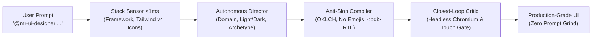

<div align="center">


# Vibe UI Suite

**Contract-driven frontend engineering, design-system constraints, and runtime verification for AI coding assistants.**

[](https://github.com/omid-io/vibe-ui-suite/actions/workflows/ci.yml)
[](https://www.npmjs.com/package/vibe-ui-suite)
[](https://www.npmjs.com/package/vibe-ui-suite)
[](https://open-vsx.org/extension/omid-io/vibe-ui-vscode)
[](https://marketplace.visualstudio.com/items?itemName=omid-io.vibe-ui-vscode)
[](https://github.com/omid-io/vibe-ui-suite)
[](LICENSE)
[](evals/)

<p align="center">
  <a href="README.fa.md"><strong>فارسی (Persian Documentation)</strong></a> •
  <a href="ARCHITECTURE.md"><strong>Architecture Specification</strong></a> •
  <a href="docs/ENTERPRISE_ADAPTATION.md"><strong>Enterprise Guide</strong></a> •
  <a href="https://omid-io.github.io/vibe-ui-suite/"><strong>Interactive Studio Playground</strong></a>
</p>

</div>

---

## ⚖️ Visual Impact: Vanilla AI Slop vs. Vibe UI V3

What happens when you ask an AI assistant to generate a frontend component?

```text
┌──────────────────────────────────────┐  vs  ┌──────────────────────────────────────┐
│ ❌ VANILLA AI SLOP                   │      │ ✨ VIBE UI V3 COMPILED               │
├──────────────────────────────────────┤      ├──────────────────────────────────────┤
│ • Generic purple gradient buttons    │      │ • Orthogonal Style DNA (26 families) │
│ • Low contrast text (3.2:1 FAILS AA) │      │ • Mathematical WCAG 2.2 AAA (17.8:1) │
│ • Broken mobile overflow (375px)     │      │ • Zero layout shift, mobile audited  │
│ • Hallucinated raw emojis            │      │ • Deterministic inline vector icons  │
│ • No loading / empty / error states  │      │ • Full 4-state lifecycle baked in    │
│ • Mixed direction text / numbers     │      │ • Strict LTR metrics & BiDi isolation│
└──────────────────────────────────────┘      └──────────────────────────────────────┘
```

👉 **[Launch the Interactive Design Compiler Studio Live](https://omid-io.github.io/vibe-ui-suite/)** — Zero server latency, instantaneous client-side domain inference & component preview.

---

Vibe UI Suite gives AI coding assistants (Cursor, Claude Code, Windsurf, Antigravity) a structured, machine-checkable framework to plan, implement, and verify frontend interfaces.

Instead of relying on fragile prompt engineering ("make this dashboard look clean and modern"), Vibe UI establishes an explicit compiler-style pipeline:

```text
User Intent
    ↓
Intent Expansion (30-parameter design contract)
    ↓
Machine-Readable Schema (design-spec.v1.schema.json)
    ↓
Visual System + Component Recipe Selection
    ↓
Code Implementation (Next.js 15 / React 19 / Tailwind OKLCH)
    ↓
Static Evaluation (Schema, luminance math, negative fixtures)
    ↓
Headless Browser Evaluation (Playwright 375px mobile overflow)
    ↓
Verified Output or Actionable Failure Diagnostics
```

> **Day-One Transparency**: Vibe UI Suite is at `v4.1.1` (Apple Cupertino Design & Kowalski Motion Physics Ergonomics). Featuring 100% live headless Chromium browser truth and causal verification across all benchmark scenarios with zero sampling skips, 7 canonical visual chemistries (including Apple Cupertino Fluid & Human Interface and Neumorphic Soft), critically damped physical spring mechanics, mobile-native touch resilience, automated motion ergonomics auditing in PhysicalCritic, persistent browser pooling running 100 mounts in <35s, sub-80ms offline zero-network React 19 local bundling, strict directional invariant contracts across all 24 canonical domains, pure in-browser PixelCritic screenshot buffer inspection, in-browser VisionSensor perceptual geometry analysis, domain-adaptive macro page architectures, and dual-tier contrast governance (Target: WCAG AAA >= 7:1 | Hard Gate: WCAG AA >= 4.5:1). Constructive criticism, issues, and contributions from frontend engineers and AI researchers are warmly welcomed.

---

## 👑 Autonomous AI Lead Architect: `mr-ui-designer`

Frontend design should not require developers to study color contrast mathematics, OKLCH formulas, CSS spring physics, or memorizing style taxonomies. That cognitive burden belongs entirely to the agent.

Vibe UI Suite includes a dedicated master architect agent: **`mr-ui-designer`** ([AGENT.md](mr-ui-designer/AGENT.md)). Powered by an autonomous **Stack Sensor** (<1ms) and **Domain Director**, it reads your project's `package.json`, existing Tailwind configuration, and component libraries, autonomously deciding the optimal design archetype, color harmony, and component flow without asking tedious setup questions.



---

### Workflow 1: Build from Scratch (1-Line Lazy Greenfield)
Just give your AI assistant (Antigravity, Cursor, Hermes, Claude Code) a single sentence describing what you need:

```text
@mr-ui-designer build a modern, high-conversion landing page for my project.
```

**Optional Domain or Vibe Hints (Never Required):**
- `@mr-ui-designer build an analytics billing dashboard with Apple Cupertino fluid style`
- `@mr-ui-designer design a crypto staking interface with dark terminal HUD aesthetic`
- `@mr-ui-designer create a patient booking screen for an aesthetic dental clinic`

**What `mr-ui-designer` guarantees automatically:**
- **Zero Raw Emojis:** Replaced with crisp, accessible inline SVG vector icons with `currentColor`.
- **WCAG AAA Contrast:** Background and foreground colors mathematically calibrated in OKLCH.
- **BiDi / RTL Isolation:** Numbers, currencies, and technical metrics wrapped in `<bdi>` so English/Persian text never flips.
- **Ergonomic Touch Targets:** Every button and interactive control meets the minimum 44x44px physical envelope.
- **Living Spring Physics:** Smooth, critically damped spring transitions (`ease-vibe-spring`) with fast exits (<180ms).

---

### Workflow 2: Surgical Redesign & Anti-Slop Rescue (Fix Ugly Existing UI)
When an existing screen or component looks like generic, cheap "AI slop" (clichéd purple gradients, yellow emojis, poor contrast, or broken RTL):

```text
@mr-ui-designer this UI looks ugly and generic. Elevate and polish it using Vibe UI anti-slop standards.
```

**What gets fixed in seconds:**
1. Strips all emojis and replaces them with tailored inline SVGs.
2. Recalculates color contrast to enforce WCAG 2.2 AA (>= 4.5:1) minimum and AAA (>= 7:1) target.
3. Isolates all numbers and badges inside `<bdi>` tags to permanently prevent bidirectional text corruption.
4. Upgrades stiff linear CSS transitions to natural, critically damped spring physics.

---

### Workflow 3: Zero-Touch Project Setup (Let the Agent Install Everything)
When starting a new project or onboarding Vibe UI Suite without touching the terminal:

```text
Install and configure vibe-ui-suite in this project and activate mr-ui-designer rules.
```

**The agent autonomously:**
1. Runs `npm install vibe-ui-suite` in your project terminal.
2. Injects `@import "vibe-ui-suite/v4.css";` into your main stylesheet (`app/globals.css` or `src/index.css`).
3. Creates your editor rule file (`.cursorrules`, `CLAUDE.md`, or `AGENTS.md`) with the full `mr-ui-designer` protocol.

---

### 🎨 The 6 Canonical Visual Archetypes (Autonomous or User-Specified)
You never need to choose a style—`mr-ui-designer` automatically selects the ideal archetype based on your domain. However, you can explicitly request any archetype:

| Archetype | Visual Philosophy | Best Suited For |
| :--- | :--- | :--- |
| **`Apple Cupertino Fluid`** | Frosted glass (`backdrop-filter`), squircles, critically damped spring motion | Modern SaaS, mobile-first web, productivity |
| **`Minimalist SaaS`** | Stripe-clean layout, neutral tones, high-density data tables | B2B platforms, developer tools, CRM |
| **`Specular Glass Luxury`** | Deep dark canvases, ambient glowing edge borders (`border-beam`) | Web3, crypto trading, gaming, high-end entertainment |
| **`Neobrutalism`** | High-contrast black borders, bold retro drop-shadows, vivid accents | Creator tools, fintech, consumer youth apps |
| **`Swiss Editorial`** | Typography-driven asymmetric grid, high editorial elegance, calm white space | Media publications, fashion, luxury real estate |
| **`Terminal HUD`** | High-density telemetry, monospaced data grids, cybernetic green/cyan | DevOps, cybersecurity, infrastructure monitoring |

---

### Alternative: 1-Command Interactive CLI Setup
If you prefer running a guided interactive wizard in your terminal:
```bash
npx vibe-ui-suite init
```

---

## 🎨 Native Tailwind CSS v4 (@theme) — Zero Config

In your `app/globals.css` or main stylesheet:
```css
@import "tailwindcss";
@import "vibe-ui-suite/v4.css";
```
Zero JavaScript configuration files needed. Instantly unlocks:
- **Semantic OKLCH colors**: `bg-vibe-canvas`, `bg-vibe-surface`, `text-vibe-primary`, `border-vibe-border`
- **Physics curves**: `ease-vibe-spring`, `ease-vibe-snap`, `ease-vibe-glide` (or utility `.vibe-spring`)
- **Material shadows**: `shadow-vibe-brutal`, `shadow-vibe-glass`

---

## 📦 Verified Component Recipes (`add`)

Add production-ready, accessible component templates directly into `components/vibe-ui/`:
```bash
# Collapsible AI reasoning drawer with CSS grid zero-JS transition & status radar
npx vibe-ui-suite add thinking-drawer

# LTR-isolated technical metric HUD for latency, tokens, and model status
npx vibe-ui-suite add telemetry-hud

# Live mathematical WCAG AA / AAA contrast compliance indicator badge
npx vibe-ui-suite add contrast-badge
```
List all available registry components:
```bash
npx vibe-ui-suite list
```

---

## 💻 Editor Extensions (VS Code & Cursor)

Vibe UI is available directly inside your IDE sidebar:

- **VS Code Marketplace**: [`omid-io.vibe-ui-vscode`](https://marketplace.visualstudio.com/items?itemName=omid-io.vibe-ui-vscode)
- **Open-VSX Registry**: [`omid-io.vibe-ui-vscode`](https://open-vsx.org/extension/omid-io/vibe-ui-vscode) (for Cursor, Windsurf, VSCodium)

### Features:
- **Interactive WCAG 2.2 Contrast Calculator**: Real-time color pickers with instant relative luminance calculation ($L_1 / L_2$) and dynamic Pass/Fail badges.
- **1-Click Component Inserter**: Insert component templates directly into your active text editor.
- **In-Editor Audit Command**: `Ctrl+Shift+P` ➔ `Vibe UI: Audit Active File Contrast`.

---

## 🏛️ Architecture: The 6-Skill Orchestration DAG

The system is coordinated by a lead architect agent (**`mr-ui-designer`**) that orchestrates 6 specialized sub-skills:

```text
               ┌──────────────────────────────┐
               │  User Prompt: "Build a UI"   │
               └──────────────┬───────────────┘
                              │
                              ▼
               ┌──────────────────────────────┐
               │       mr-ui-designer         │
               │  (Lead Frontend Architect)   │
               └──────────────┬───────────────┘
                              │
       ┌──────────────┬───────┴───────┬──────────────┐
       ▼              ▼               ▼              ▼
┌──────────────┐┌──────────────┐┌──────────────┐┌──────────────┐
│  autonomous- ││   visual-    ││   ui-kit     ││    vibe-     │
│    intent-   ││  chemistry-  ││  (70+ AI     ││   physics-   │
│   expander   ││    engine    ││   Recipes)   ││    engine    │
└──────┬───────┘└──────┬───────┘└──────┬───────┘└──────┬───────┘
       │               │               │               │
       └───────────────┼───────────────┴───────────────┘
                       │
                       ▼
       ┌──────────────────────────────┐
       │   conversion-copy-engine     │
       │   (PAS, JTBD, Anti-Deception)│
       └──────────────┬───────────────┘
                      │
                      ▼
       ┌──────────────────────────────┐
       │         ui-verifier          │
       │  (5-Pillar Quality Gate)     │
       └──────────────┬───────────────┘
                      │
                      ▼
       ┌──────────────────────────────┐
       │ Evaluated Frontend Code + Log│
       └──────────────────────────────┘
```

| Sub-Skill | Role & Boundary | Primary Constraint |
| :--- | :--- | :--- |
| **`autonomous-intent-expander`** | Intent synthesis via 30-parameter contract | Calibrated Ambiguity Budget; rejects unstated business assumptions |
| **`visual-chemistry-engine`** | Cohesive aesthetic system selection | 5 distinct chemistries; anti-repetition constraint across projects |
| **`ui-kit`** | Component primitives & interaction patterns | AI reasoning drawers, tool chips, telemetry HUDs, Bento recipes |
| **`vibe-physics-engine`** | Motion, color, and GPU budgets | OKLCH perceptual spaces, spring curves, strict $\le 3$ blur layer limit |
| **`conversion-copy-engine`** | Strategic narrative architecture | Domain-aware copy; strictly prohibits fake testimonials or false urgency |
| **`ui-verifier`** | Automated quality & accessibility gates | Static math + headless browser runtime DOM assertions |

---

## 🎨 Five Visual Chemistries

Vibe UI defines five visual systems for consistent design decisions:

1. **Minimalist SaaS**: Monochrome restraint, precision borders, high information density, functional typography (`oklch(0.12 0.01 260)`).
2. **Luxury Obsidian / Glass 2.0**: Dark substrates, specular Fresnel highlights, subtle gold accents, controlled GPU backdrop blur budget (`oklch(0.08 0.02 270)`).
3. **Neobrutalism**: High-contrast saturated cards, hard 3px black offset geometric drop-shadows, zero blur, explicit physical boundaries (`oklch(0.98 0.02 95)`).
4. **Swiss Editorial**: Asymmetric typographic grid, content-first layout inspired by the International Typographic Style (`oklch(0.97 0.005 80)`).
5. **Stripe Crisp Light**: Developer-first documentation aesthetic, micro-borders, clean typography, subtle shadows (`oklch(0.99 0.002 250)`).

---

## 🌐 Fixed-Structure Semantic RTL

Standard AI-generated interfaces frequently fail on Right-to-Left (RTL) languages by naively flipping the entire DOM tree with `dir="rtl"`, inverting navigation columns, telemetry charts, and numeric sequences.

Vibe UI enforces **Fixed-Structure Semantic RTL**:
- **Physical Macro Stability**: Application layout coordinates (sidebars, toolbars, chart axes) remain physically stable.
- **Content-Level RTL**: RTL is applied strictly to typography, paragraphs, and reading flows using CSS logical properties (`margin-inline-start`, `text-align: start`).
- **BiDi Resilience**: Technical identifiers, code blocks, URLs, and telemetry HUDs are explicitly isolated with `<bdi>` or `dir="ltr"`.

---

## 🧪 Evaluation Suite & Runtime Quality Gates

The repository includes an automated test runner:

```bash
# 1. Run deterministic static checks & negative fixtures
python evals/run_evals.py

# 2. Run machine-readable CI output
python evals/run_evals.py --json

# 3. Run headless browser DOM verification (Chromium via Playwright)
python evals/run_evals.py --browser
```

### Deterministic vs. Heuristic Checks:

| Verification Gate | Type | Method | Scope |
| :--- | :--- | :--- | :--- |
| **JSON Schema Validation** | Deterministic | Draft 2020-12 Schema Validator | Validates 30 parameters with `additionalProperties: false` |
| **Negative Fixture Rejection** | Deterministic | Exit code assertion | Verifies exit code 1 on out-of-range entropy, invalid archetypes, or touch targets $< 24\text{px}$ |
| **Relative Luminance & Contrast** | Deterministic | $L = 0.2126 R' + 0.7152 G' + 0.0722 B'$ | Enforces WCAG AA ($\ge 4.5:1$ body, $\ge 3.0:1$ headings) |
| **Mobile Viewport Overflow** | Runtime | Chromium DOM (`scrollWidth <= clientWidth`) | Verifies 0px horizontal overflow at exact 375px viewport |
| **Semantic Clickables** | Static / Lint | Regex DOM tree audit | Asserts 0 raw `<div onclick>` instances (buttons/anchors required) |
| **Focus Rings** | Static / Lint | CSS rule check | Verifies presence of `:focus-visible` styles |
| **GPU Compositing Budget** | Static / Heuristic | CSS rule check | Enforces $\le 3$ active `backdrop-filter` blur layers |

---

## 📦 Next.js 15 Production Starter

A reference production starter is available under [`examples/nextjs-starter/`](examples/nextjs-starter/):
- **Core**: Next.js 15 App Router, React 19, TypeScript 5, Tailwind CSS.
- **Typed OKLCH Tokens**: [`lib/tokens.ts`](examples/nextjs-starter/lib/tokens.ts) exporting all 5 chemistries.
- **AI Primitives**: [`AiThinkingDrawer.tsx`](examples/nextjs-starter/components/AiThinkingDrawer.tsx) with zero-JS CSS Grid height transitions and accessible ARIA live regions.
- **Verified Clean Build**: Compiles in production mode (`npm run build`) in CI with zero type errors.

---

## 🛡️ What Vibe UI Is — and What It Is Not

### What It Is:
- A contract-driven linter, design system, and verification layer for AI coding assistants.
- An orchestration DAG that separates intent, visual rules, component code, copy, and verification.
- A set of executable evaluation gates that reject measurable UI regressions with non-zero exit codes.

### What It Is Not:
- It is **not** a guarantee that an AI-generated interface is 100% bug-free or production-ready without human review.
- It is **not** a replacement for comprehensive manual accessibility testing (screen readers, voice control).
- It is **not** an enterprise design system replacement; it is designed to bind into your existing `@company/ui` library via [`docs/ENTERPRISE_ADAPTATION.md`](docs/ENTERPRISE_ADAPTATION.md).

---

## 🤝 Contributing & Community

Vibe UI Suite is open-source under the **MIT License**. We actively welcome community contributions:
- New evaluation fixtures & negative tests
- Framework adapters (Vue, Svelte, Angular)
- Component recipes for the registry
- Real-world bug reports with minimal reproductions

```bash
git clone https://github.com/omid-io/vibe-ui-suite.git
cd vibe-ui-suite
python evals/run_evals.py
```

Maintainer: [Omid Zaferi](https://github.com/omid-io) • Issues: [GitHub Issues](https://github.com/omid-io/vibe-ui-suite/issues)
